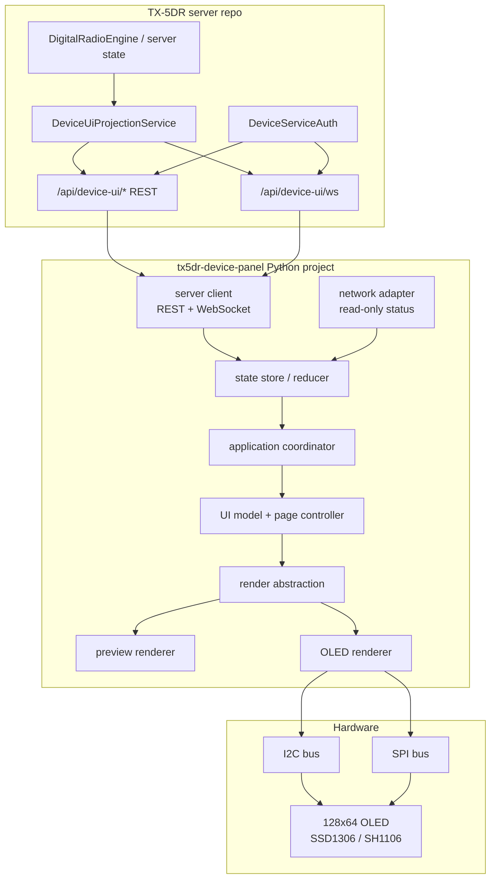

# Python Device Panel 架构与实施计划

**状态**: 决策已确认，可进入实施阶段。  
**结论方向**: 放弃当前 `codex/device-ui-implementation` 分支上的 Node daemon + C/C++ renderer 方案，改为 server device API 与独立 Python 小屏项目分离推进。  
**初期硬件目标**: `128x64` OLED 点阵屏，支持 I2C/SPI 两种物理接线，支持 SSD1306 与 SH1106 控制器。  
**未来预留**: 为 LCD/TFT/更复杂渲染后端保留接口，但 MVP 不实现。  

## 1. 背景与架构调整

原方案在 `packages/device-ui` 内新增 Node.js daemon，并维护两个 native renderer：

- TFT: C + LVGL
- OLED: C++ + U8g2
- daemon 与 renderer 之间使用 Unix socket / NDJSON / ack / patch 协议

该方案工程分层完整，但 MVP 维护成本过高。尤其是我们当前真正需要的是一个可靠、低频、低分辨率的设备状态与引导屏，而不是完整触摸操作台。

因此新方向调整为：

1. **server 仓库只负责 device API 路由、鉴权和状态裁剪**。
2. **小屏逻辑迁移到一个新的独立 Python 项目**，计划放在 `~/Documents/coding` 下。
3. Python 项目直接负责：
   - 与 TX-5DR API server 通信；
   - 维护本地面板状态；
   - 组织页面和渲染抽象；
   - 调用 OLED/LCD/preview 后端；
   - 最终落到 I2C/SPI 等屏幕硬件。
4. 初期只支持 OLED `128x64`，不做 TFT/LCD 实机渲染。

## 2. 分支与项目策略

### 2.1 当前旧分支处理

旧分支：

```text
codex/device-ui-implementation
```

处理策略：

- 不继续在该分支上开发。
- 不从该分支 cherry-pick Node daemon 或 native renderer 实现。
- 可仅作为历史参考保留，不要求删除远端分支。
- 新方案从 `main` 重新开分支，避免旧实现污染主线。

### 2.2 server API 分支

计划新建 server 分支：

```text
codex/device-ui-server-api
```

该分支只做 server 仓库内的最小必要改动：

- 新增 `/api/device-ui/*` REST 路由。
- 新增 `/api/device-ui/ws` 专用 WebSocket。
- 新增 device service auth。
- 新增 projection service，把 TX-5DR 内部状态裁剪成小屏可消费模型。
- 不实现 pairing code、pairing session 或任何临时登录兑换机制。
- 测试确保 device WS 不计入普通浏览器客户端数量。

该分支应尽快合并到 `main`，作为 Python 小屏项目的后端依赖。

### 2.3 Python 小屏项目

计划在 `~/Documents/coding` 下新增独立项目，例如：

```text
~/Documents/coding/tx5dr-device-panel
```

该项目必须初始化为独立 git repo，不作为当前 monorepo workspace 包管理，理由：

- Python 依赖、systemd 打包、硬件驱动生命周期与 Node monorepo 不同。
- 独立发布和部署更简单。
- Raspberry Pi / H618 / Linux SBC 镜像上安装更直接。
- 避免 Node workspace 构建和 Python 打包互相耦合。

Python 项目使用 Python `>=3.11` 和标准 `pyproject.toml`。开发期可以使用 `uv` 提升效率，但运行期只要求 venv/pip 能完成安装。

## 3. 新总体架构



## 4. 核心边界

### 4.1 server 仓库负责

server 仓库只负责小屏需要的服务端能力：

| 模块 | 职责 |
|---|---|
| Device service auth | 识别小屏设备身份，签发短期 device JWT |
| Device routes | 提供 health、session、bootstrap 等 REST API；不提供 pairing code/session |
| Device WebSocket | 推送小屏状态事件，不进入普通浏览器 WS 统计 |
| Projection service | 从 server/engine 内部状态裁剪出小屏模型 |

server 仓库不负责：

- 小屏页面布局；
- OLED/LCD 渲染；
- I2C/SPI；
- 本机屏幕预览；
- Wi-Fi UI 流程细节；
- Python 项目打包。

### 4.2 Python 项目负责

Python 项目负责设备侧完整流程：

| 层 | 职责 |
|---|---|
| network layer | 连接 server REST/WS、处理重连、device JWT、事件解码 |
| domain/state layer | 聚合 server 状态和本机网络状态，生成 PanelModel |
| UI abstraction layer | 页面状态机、导航、文案、布局意图、组件树或 draw commands |
| render layer | 把 UI 抽象落实到具体 renderer，例如 OLED、preview、未来 LCD |
| hardware adapter layer | I2C、SPI、屏幕驱动参数 |

Python 项目不负责：

- 伪装普通浏览器 WebSocket；
- 持有长期 admin token；
- 创建 pairing code、临时登录 session 或任何登录授权；
- 直接写 TX-5DR server 内部配置文件；
- 执行高权限网络操作。

## 5. 分层设计原则

必须避免把网络、业务抽象和渲染混在一起。

### 5.1 推荐依赖方向

```text
server_client -> state_store -> app_controller -> ui_model -> renderer -> device_driver
network_adapter -> state_store
```

禁止反向依赖：

- renderer 不直接调用 server API。
- renderer 不直接执行网络配置命令。
- server_client 不知道 OLED/LCD 的像素布局。
- network_adapter 不知道页面如何显示。
- hardware driver 不知道 radio state、operator 等业务含义。

### 5.2 三类模型

实现必须明确区分三类模型：

| 模型 | 所在层 | 说明 |
|---|---|---|
| `DeviceServerSnapshot` | network layer | server API 原始模型，尽量贴近接口返回 |
| `PanelState` | domain/state layer | 合并 server 和本机网络状态后的业务状态 |
| `RenderFrame` / `DrawCommand` | UI/render layer | 与具体硬件无关的绘制意图 |

示例：

```text
server event: radio.frequencyChanged
  -> PanelState.radio.frequency_hz = 7074000
  -> MonitorPage creates Text("7.074 MHz") and Bars(...)
  -> OledRenderer draws pixels into 128x64 framebuffer
  -> I2C/SPI driver flushes framebuffer
```

## 6. 初期 OLED 硬件范围

### 6.1 固定目标

| 项 | MVP 决策 |
|---|---|
| 分辨率 | `128x64` |
| 色彩 | 单色 1-bit |
| 控制器 | SSD1306、SH1106 |
| 物理协议 | I2C、SPI |
| 默认 I2C bus | Linux 默认可配置，常见为 `/dev/i2c-1` |
| 默认 I2C address | `0x3C`，允许 `0x3D` |
| SPI | MVP 必须支持 SPI 配置和实机路径，bus/device/DC/RST/CS 参数可配置 |
| 输入 | MVP 不做按键、触摸或旋钮输入，只负责呈现当前状态；GPIO 按键作为未来预留 |
| 字体 | 初期优先 ASCII 英文短文案，避免 CJK 字体体积和点阵可读性问题 |

### 6.2 控制器差异

| 控制器 | 关注点 |
|---|---|
| SSD1306 | 最常见，作为默认路径 |
| SH1106 | 常见 128x64，但显存/列偏移与 SSD1306 不完全相同；默认 column offset 为 `2`，允许配置覆盖 |

配置字段：

```yaml
display:
  type: oled
  width: 128
  height: 64
  controller: ssd1306   # ssd1306 | sh1106
  transport: i2c        # i2c | spi | preview
  rotate: 0             # 0 | 90 | 180 | 270
  contrast: 160
  sh1106_column_offset: 2
```

I2C 示例：

```yaml
display:
  transport: i2c
  i2c:
    bus: 1
    address: 0x3C
```

SPI 示例：

```yaml
display:
  transport: spi
  spi:
    port: 0
    device: 0
    gpio_dc: 24
    gpio_rst: 25
    gpio_cs: null
```

### 6.3 刷新策略

OLED 不是动画屏，必须低频、事件驱动刷新。

| 场景 | 刷新策略 |
|---|---|
| 普通 access/status 页 | 状态变化刷新，最多 1 FPS |
| slot countdown | 1 FPS |
| TX/PTT active | 最多 2 FPS |
| 简化 spectrum bars | 最多 2 FPS |
| 网络变化/错误 | 立即刷新一次 |
| 空闲防烧屏 | 低频页面轮换或 1px 偏移，周期待实机验证 |

实现要求：

- 使用 dirty flag 合并重复状态更新。
- 不允许无 sleep 的忙循环。
- 字体、图标和固定图形缓存。
- 只有 framebuffer 内容变化时才 flush。
- 性能日志记录 render 耗时、flush 耗时、刷新次数。

## 7. 页面范围

### 7.1 MVP 页面

| 页面 | 目的 | OLED 展示内容 |
|---|---|---|
| Boot | 设备启动和 server 连接中 | TX-5DR、IP/网络状态、server connecting |
| Access | 用户如何访问 Web UI | 当前网络连接摘要、host/IP、局域网 URL、web port |
| Network | 网络状态 | eth/wifi/hotspot/offline、SSID/IP、本机只读网络状态 |
| FT8 Monitor | FT8 运行摘要 | 固定状态栏、UTC 时间、周期/slot、最近解码、底部本机 TX 状态和发送内容 |
| Voice Monitor | 语音模式运行摘要 | 固定状态栏、频率、模式、PTT/TX 状态、连接状态 |
| Error | 明确错误状态 | 错误码、短提示、恢复动作提示 |
| Diagnostics | 调试信息 | device id、server、WS、render backend、IP |

### 7.2 初期不做

- OLED 上输入 Wi-Fi 密码。
- OLED 上展示完整 Wi-Fi 扫描列表。
- OLED 上展示 QR code。
- OLED 上进行完整电台控制。
- OLED 上展示 pairing code 或创建临时登录 session。
- 多语言/CJK 字体渲染。
- LCD/TFT 实机渲染。
- 平滑动画和复杂组件。

## 8. 状态呈现设计

MVP 不做任何实体按键、触摸或旋钮输入，只负责呈现当前状态。屏幕页面由应用状态自动决定，避免在小屏端引入交互复杂度。

| 场景 | 页面行为 |
|---|---|
| server 启动中/不可达 | 显示 Boot/Connecting 状态 |
| 引擎未启动，且 server ready | 显示 Access 状态，重点呈现当前网络连接和局域网访问 URL |
| 引擎启动，当前模式为 FT8 | 始终展示 FT8 Monitor，重点呈现解码数据、周期、TX 状态和发送内容 |
| 引擎启动，当前模式为语音 | 始终展示 Voice Monitor，重点呈现频率、模式和 PTT/TX 状态 |
| 引擎启动，当前模式暂未专项适配 | 展示 Generic Monitor，至少包含频率、模式、PTT/TX 和连接状态 |
| 无网络或网络异常 | 显示 Network/Error 状态 |
| radio/server error | Error 状态优先于普通模式页面 |
| PTT/TX active | 不强制切页；通过全局最外圈描边和顶部 PTT/TX 强标识突出显示 |
| 长时间空闲 | 不轮播 Diagnostics；保持当前 Access 或模式页面 |

### 8.1 运行态通用布局约束

运行态页面必须有统一外框和状态栏，避免不同模式页面割裂：

- 顶部固定状态栏显示 UTC 时间、server/WS 状态、radio 连接摘要。
- FT8 模式状态栏必须显示当前 15 秒周期/slot 信息。
- PTT/TX active 时，顶部显示强 PTT/TX 标识，屏幕最外圈显示高对比描边。
- 非 PTT 状态下保留普通边框或无强调边框，避免误导用户。
- 底部一行优先给本机 TX 状态、待发送/正在发送内容或关键错误摘要。

### 8.2 FT8 页面信息优先级

FT8 模式下，`128x64` 页面空间优先级如下：

1. 顶部状态栏：UTC 时间、slot/周期、连接摘要。
2. 中部列表：最近接收到的 FT8 解码数据，优先显示与本机呼号/当前操作相关的信息。
3. 底部状态行：本机 TX 状态、正在发送或即将发送的内容。
4. 全局 PTT/TX 强标识：外圈描边 + 顶部标识，不占用主要文本区域。

### 8.3 语音页面信息优先级

语音模式下，页面重点不展示解码列表，而是突出电台工作状态：

1. 顶部状态栏：UTC 时间、连接摘要。
2. 主信息区：当前频率、模式、radio connected/disconnected。
3. 状态区：PTT/TX、音频/链路状态摘要。
4. 全局 PTT/TX 强标识：外圈描边 + 顶部标识。

交互能力作为未来预留，不进入 MVP：

- 单 GPIO 按键。
- 多按键/旋钮。
- 触摸。
- 小屏触发 hotspot。
- 小屏刷新 token 或创建临时登录 session。

因此 MVP 内 hotspot、网络配置、登录授权等动作都应由 server/Web UI 或自动状态逻辑触发，小屏只展示结果，不发起任何控制动作。GPIO 按键相关模块可以在架构中预留接口，但不在 MVP 中实现硬件读取或业务动作。

## 9. 非实机预览能力

Python 项目必须支持无硬件开发，避免每次 UI 调整都依赖实机。

### 9.1 预览目标

| 能力 | 要求 |
|---|---|
| 屏幕窗口预览 | 在 macOS/Linux 开发机显示 `128x64`，整数倍放大 |
| PNG snapshot | fixture 可生成 deterministic PNG，用于回归对比 |
| 键盘输入 | MVP 不需要；preview 可仅支持退出/切换 fixture 等开发辅助快捷键 |
| fixture 模式 | 不启动 TX-5DR server 也能预览所有主页面 |
| live 模式 | 可连接本地或局域网 server，显示真实状态 |

### 9.2 预览后端

| 后端 | 用途 |
|---|---|
| Pillow PNG | 必须实现；用于 deterministic snapshot 和 CI |
| pygame | 必须实现；用于本地窗口交互预览和 fixture 快速切换 |

预览命令设想：

```bash
tx5dr-device-panel preview --fixture access-wifi-ready --scale 6
```

生成截图：

```bash
tx5dr-device-panel snapshot --fixture monitor-tx-active --output /tmp/monitor.png
```

连接真实 server：

```bash
tx5dr-device-panel preview --server http://127.0.0.1:8076 --scale 6
```

## 10. Python 项目结构

```text
tx5dr-device-panel/
  pyproject.toml
  README.md
  docs/
    architecture.md
    hardware.md
    server-api.md
  src/tx5dr_device_panel/
    __init__.py
    __main__.py
    config.py
    logging.py

    server/
      __init__.py
      client.py
      auth.py
      websocket.py
      models.py
      events.py

    state/
      __init__.py
      store.py
      reducer.py
      models.py

    network/
      __init__.py
      status.py
      models.py

    ui/
      __init__.py
      app_controller.py
      navigation.py
      pages.py
      components.py
      layout.py
      models.py

    render/
      __init__.py
      base.py
      framebuffer.py
      oled_luma.py
      preview.py
      snapshot.py
      lcd_base.py

    hardware/
      __init__.py
      oled_config.py
      gpio_reserved.py

    fixtures/
      access_wifi_ready.json
      access_hotspot_ready.json
      boot_server_connecting.json
      monitor_idle.json
      monitor_tx_active.json
      monitor_radio_error.json

  tests/
    test_reducer.py
    test_layout_oled_128x64.py
    test_snapshot_fixtures.py
    test_server_event_mapping.py
```

### 10.1 未来 LCD/TFT 预留点

当前不实现 LCD/TFT，但 render 层不要写死 OLED。

渲染抽象：

```python
class DisplayRenderer:
    width: int
    height: int
    color_mode: str

    def render(self, frame: RenderFrame) -> None:
        ...

    def close(self) -> None:
        ...
```

OLED renderer 使用 `mono1` framebuffer；未来 LCD renderer 可以使用 `rgb565` 或 `rgb888` framebuffer。

```python
class RenderFrame:
    page_id: str
    commands: list[DrawCommand]
    full_refresh: bool = False
```

`DrawCommand` 初期只需要支持：

- text
- line
- rectangle
- filled rectangle
- icon bitmap
- bar graph
- invert region

未来 LCD/TFT 可以扩展：

- color
- image
- alpha
- touch target
- animation hint
- dirty rect

## 11. server API 范围

server 分支应实现的最小接口如下。

### 11.1 Public health

```http
GET /api/device-ui/health
```

返回：

```json
{
  "status": "ok",
  "service": "tx5dr-device-ui",
  "time": "2026-05-14T00:00:00.000Z"
}
```

要求：

- 公开可访问。
- 不返回 operator、radio、token、网络详情。

### 11.2 Device session

```http
POST /api/device-ui/session
```

用途：

- Python panel 使用本地 device token 换取短期 device JWT。
- JWT audience 固定为 `tx5dr-device-ui`。
- 不复用普通用户 JWT，不产生 `UserRole`。

### 11.3 Bootstrap

```http
GET /api/device-ui/bootstrap
Authorization: Bearer <device-jwt>
```

返回初始小屏状态：

```json
{
  "server": {
    "status": "ok",
    "version": "...",
    "webPort": 8076
  },
  "station": {
    "callsign": "BG5DRB"
  },
  "engine": {
    "running": true,
    "mode": "digital",
    "currentMode": { "name": "FT8", "slotMs": 15000 },
    "state": "running"
  },
  "radio": {
    "connected": true,
    "frequency": 7074000,
    "radioMode": "USB-D",
    "ptt": false,
    "tx": false
  },
  "ft8": {
    "slot": null,
    "utc": null,
    "cycle": null,
    "periodMs": 15000,
    "recentDecodeRawMessages": [],
    "lastDecodeRawMessage": null,
    "recentFrames": [],
    "currentTx": {
      "active": false,
      "operatorIds": [],
      "messages": [],
      "lastMessage": null,
      "slotStartMs": null
    }
  },
  "voice": {
    "active": false,
    "radioMode": null,
    "pttLocked": false,
    "pttLockedByLabel": null,
    "keyerActive": false,
    "keyerMode": null,
    "keyerSlotId": null
  },
  "access": {
    "localUrl": "http://192.168.1.10:8076"
  },
  "updatedAt": 1778697600000
}
```

### 11.4 不实现 pairing code

MVP 不提供 pairing code、pairing session 或临时登录兑换接口。小屏只展示局域网访问 URL，用户登录仍走现有 Web UI 鉴权流程。

### 11.5 Device WebSocket

```http
GET /api/device-ui/ws
Authorization: Bearer <device-jwt>
```

要求：

- 不接受普通用户 JWT。
- 不发送普通 `clientHandshake`。
- 不调用普通 `WSServer.addConnection()`。
- 不改变普通 `clientCountChanged.count`。
- 只推送小屏需要的裁剪事件。

MVP 事件类型只使用 snapshot。后续如需要增量事件，必须先更新 contracts 和本文档。

```json
{ "type": "snapshot", "payload": { } }
```

## 12. 网络能力边界

Python panel 需要展示本机网络状态，但真实网络变更要谨慎。

### 12.1 MVP 网络展示

MVP 至少展示：

- Ethernet 是否在线。
- Wi-Fi 是否在线。
- 当前 SSID。
- 当前 IP。
- 是否处于 hotspot 模式。
- TX-5DR Web URL。
- server 是否可连接。

### 12.2 网络变更

MVP 不实现网络变更，不提供 root helper，也不通过小屏执行热点开关、Wi-Fi 扫描、连接或忘记网络。Python panel 只读取本机网络状态并展示。

未来如果需要从设备侧发起网络变更，必须另行设计 allowlist root helper：

```text
tx5dr-device-panel  --普通 tx5dr 用户运行
  -> /run/tx5dr/network-helper.sock
    -> tx5dr-network-helper --root 运行，只接受 allowlist 操作
```

OLED 上不输入 Wi-Fi 密码。

## 13. 配置与运行

### 13.1 配置来源

配置优先级：

```text
CLI args > environment variables > config file > defaults
```

默认配置路径：

```text
/etc/tx5dr/device-panel.yaml
/var/lib/tx5dr/device-panel/state.json
```

开发模式可用：

```text
./device-panel.dev.yaml
```

### 13.2 systemd 服务

```ini
[Unit]
Description=TX-5DR Device Panel
After=network-online.target tx5dr.service
Wants=network-online.target

[Service]
Type=simple
User=tx5dr
Group=tx5dr
ExecStart=/usr/bin/tx5dr-device-panel run --config /etc/tx5dr/device-panel.yaml
Restart=always
RestartSec=3
Nice=10
CPUWeight=20

[Install]
WantedBy=multi-user.target
```

## 14. 性能预算

针对 `128x64` OLED：

```text
128 * 64 / 8 = 1024 bytes / frame
```

预算目标：

| 指标 | 目标 |
|---|---|
| 空闲 CPU | 接近 0，长期低于 1-2% 为佳 |
| 普通刷新 | 最多 1 FPS |
| TX/频谱刷新 | 最多 2 FPS |
| 内存 | 接受 Python 固定开销，但需要实机记录 RSS |
| 日志 | 不高频写磁盘 |
| 主业务影响 | panel 使用低优先级，不影响 TX-5DR server/audio/radio |

性能日志字段：

```text
render_count_per_minute
avg_render_ms
max_render_ms
avg_flush_ms
max_flush_ms
ws_reconnect_count
rss_mb
```

## 15. 测试计划

### 15.1 server 仓库测试

- device session 成功/失败。
- 普通 JWT 不能访问 device API。
- device JWT 不能访问普通用户 API。
- `/api/device-ui/health` 不泄露敏感信息。
- device WS 不改变普通 browser client count。
- server 不提供 pairing code/session endpoint。
- projection service 输出字段稳定。

### 15.2 Python 项目测试

- server event -> `PanelState` reducer。
- network status -> `PanelState` reducer。
- page navigation 状态机。
- 每个 fixture 生成 deterministic PNG。
- OLED `128x64` 布局不越界。
- SSD1306/SH1106 配置选择。
- I2C/SPI config parsing。
- preview fixture 切换或开发辅助快捷键。

### 15.3 实机验证

- SSD1306 I2C `128x64`。
- SH1106 I2C `128x64`，验证默认 column offset `2`，并验证配置覆盖。
- SSD1306 SPI 或 SH1106 SPI，验证 DC/RST/CS 配置。
- 24 小时运行，观察 CPU、RSS、I2C/SPI 错误。
- TX 发射/接收状态变化时屏幕及时更新。
- server 重启、小屏自动重连。
- 网络断开/恢复后 URL 显示正确。

## 16. 里程碑

### Milestone A: server API branch

分支：

```text
codex/device-ui-server-api
```

交付：

- REST + WS device API。
- device JWT。
- projection service。
- 测试覆盖。
- 尽快合并 `main`。

### Milestone B: Python project skeleton

项目：

```text
~/Documents/coding/tx5dr-device-panel
```

交付：

- `pyproject.toml`。
- 配置解析。
- fixture 模式。
- preview/snapshot。
- UI/render/state 分层骨架。

### Milestone C: OLED preview MVP

交付：

- 6 个 fixture 页面。
- PNG snapshot。
- 本地窗口预览。
- fixture 自动页面选择和 preview 开发辅助快捷键。

### Milestone D: live server MVP

交付：

- 连接 server health/session/bootstrap/ws。
- 自动重连。
- Access 网络入口显示。
- FT8/语音模式页面状态更新。

### Milestone E: OLED hardware MVP

交付：

- SSD1306 I2C。
- SH1106 I2C。
- SPI path。
- systemd service。
