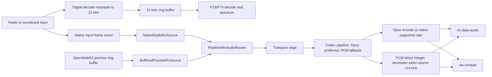
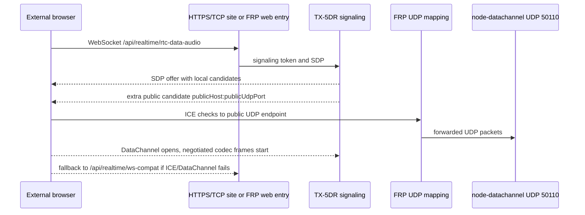
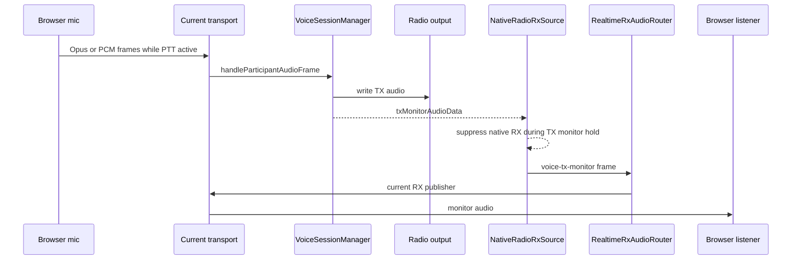

# Realtime Audio Architecture

## Design Goal

TX-5DR keeps digital decoding audio and realtime radio monitoring explicit and separate. Radio monitoring uses native input frames in both voice and digital modes; the digital 12 kHz ring buffer is internal to decode/spectrum work.

## Digital 12 kHz Chain

The digital chain is centered on the existing 12 kHz ring buffer. It serves FT8/FT4 decode and spectrum work only.

- Soundcard input may be resampled into the digital 12 kHz format.
- ICOM WLAN input is already 12 kHz and can be written directly to the digital path.
- This path is not used for radio realtime listening in either voice or digital mode.
- OpenWebRX preview remains a buffered preview use case and is not part of the native radio bypass.

## Native Radio Bypass Chain

The radio bypass exists to avoid hidden latency from the digital ring buffer.

- Soundcard radio input emits `nativeAudioInputData` before digital resampling.
- ICOM WLAN emits native 12 kHz frames without extra conversion.
- `NativeRadioRxSource` subscribes to native input frames and TX monitor frames.
- `RealtimeRxAudioRouter` chooses `NativeRadioRxSource` for every `scope === 'radio'` session.
- OpenWebRX preview continues to use `BufferedPreviewRxSource` backed by `BufferedPreviewAudioService`.

## Transport Edge Chain

Transport publishers are edge components. They do not decide which audio source is correct.

- `rtc-data-audio` sends codec-aware audio frames over unordered/unreliable WebRTC DataChannel.
- `rtc-data-audio` signaling is same-origin WebSocket `/api/realtime/rtc-data-audio`; media uses the fixed UDP port configured by `RTC_DATA_AUDIO_UDP_PORT` (default `50110`) with ICE UDP mux.
- For FRP or static NAT, admins may set an external rtc-data-audio public host/IP and UDP port. The server appends those as extra outgoing ICE host candidates and keeps the original local candidates, so LAN/direct clients still work.
- `ws-compat` sends the same codec-aware frame stream over WebSocket and relies on stale-frame dropping to avoid latency buildup.
- Both transports share the browser AudioContext/AudioWorklet runtime during fallback; only the network transport is replaced.
- Codec preference is negotiated per session: `auto` defaults to Opus when both browser WebCodecs and server audify Opus backend are available; otherwise the selected transport uses PCM s16le.
- Opus runs over both transports. Codec failure falls back to PCM on the same transport; only RTC ICE/DataChannel failure falls back to `ws-compat`.

Opus is the default low-bandwidth codec path:

- Soundcard 48 kHz radio frames are encoded as Opus 48 kHz without the PCM decimator.
- ICOM WLAN 12 kHz frames are encoded as Opus 12 kHz when the browser advertises 12 kHz decode support; otherwise the server uses a low-latency streaming resampler to the negotiated supported Opus rate, usually 48 kHz.
- 24 kHz and 16 kHz native inputs are encoded at their source rate.
- Non-standard source rates are normalized by a streaming resampler to the nearest supported Opus rate (`48k/24k/16k/12k/8k`).
- Opus uses 20 ms frames. Expected software latency overhead is roughly `+18-30 ms`, mainly packetization plus encode/decode scheduling, in exchange for reducing typical realtime mono bitrate from hundreds of kbps PCM to about `24-32 kbps`.

PCM fallback remains intentionally simple and compatible. High-rate native PCM is reduced only at this transport edge. The source remains native, but publishers can apply a direct integer decimator for common high-rate inputs:

- 48 kHz soundcard radio frames are sent as 24 kHz PCM by keeping every other sample.
- 96 kHz sources are sent as 24 kHz PCM by keeping every fourth sample.
- 24 kHz, 16 kHz, and 12 kHz sources are sent unchanged.
- 12 kHz ICOM WLAN frames and 16 kHz buffered preview frames are sent unchanged.
- The decimator keeps phase across chunks, so non-divisible device buffer sizes do not accumulate drift; the frame `sampleRate` metadata always reflects the transport sample rate.
- Unusual high input rates still use the smallest integer factor that keeps the transport rate near or below 24 kHz, instead of falling back to full-rate PCM.
- This intentionally removes the previous transport-edge low-pass FIR to test whether 24 kHz direct integer decimation is acceptable in practice with less processing and less tonal coloration.

## FRP Public UDP Candidate Flow

The public UDP setting is deliberately append-only. A bad FRP endpoint should not break local candidates, and session startup still has `ws-compat` as the guaranteed fallback.

## Voice Keyer TX Monitor

Voice keyer monitoring is part of the voice source layer, not a transport-specific shortcut.

The invariant is that TX monitor audio follows the same RX publisher path as normal radio listening. This keeps `rtc-data-audio` and `ws-compat` behavior consistent and prevents transport-specific hidden monitor paths.

## Voice TX Uplink

Manual microphone PTT uses the same public transports as monitoring, but the TX path has its own realtime queue policy.

- Browser capture emits 16 kHz mono 20 ms frames.
- `VoiceTxUplinkSender` is the single browser-side sender for `rtc-data-audio` and `ws-compat`; it gates on PTT, encodes Opus when negotiated, assigns sequence numbers, applies clock-sync timestamps when reliable, and drops frames when transport backlog exceeds the realtime budget.
- Server transport handlers decode Opus/PCM frames through the same codec pipeline and pass decoded samples to `VoiceSessionManager`; they do not own output buffering policy.
- `VoiceTxOutputPipeline` owns server-side jitter buffering, streaming linear resampling to the selected TX device rate, stale-frame dropping, short tail-PLC/silence recovery, and output write diagnostics.
- TX diagnostics keep strict end-to-end timing separate from server-only timing: `endToEndMs` is recorded only when browser/server clock sync is reliable, while `serverPipelineMs` covers server receive to output write for fallback troubleshooting.
- PTT startup disables output playout until radio PTT is active; only a small startup buffer is retained, and old frames are trimmed rather than flushed late.

## Latency Policy

Realtime voice audio is a state stream, not a file stream.

- Prefer dropping late frames over playing stale audio.
- Keep publisher queues bounded in milliseconds.
- Use frame timestamps and sequence numbers for recovery and diagnostics.
- Do not re-enter large playback prefill after underrun; use at most one short PLC tail, then silence briefly and resume with fresh frames.
- Keep sample-rate conversion only at true transport/device edges.
- During transport fallback, keep the browser AudioContext and AudioWorklet runtime alive; only replace the network transport. This avoids autoplay/microphone gesture regressions and prevents duplicate audio services.
